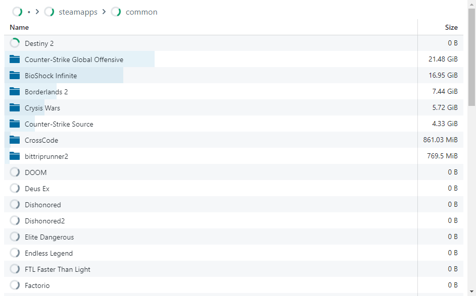

# disk-usage

A disk usage visual that uses multiple threads to scan your disk the quickest it possibly can!

## Example

```bat
cargo run --release -- D:\SteamLibrary\
```



## Usage

```
USAGE:
    disk-usage [FLAGS] <PATH>

FLAGS:
    -v, --debug         Show debug messages, multiple flags for higher verbosity
    -h, --help          Prints help information
    -k                  Keep program alive after websocket closed
    -n, --no-browser    Don't open browser
    -V, --version       Prints version information

ARGS:
    <PATH>    Path [default: .]
```

## Install

```
cargo install --git https://github.com/SpiralP/disk-usage.git
```
